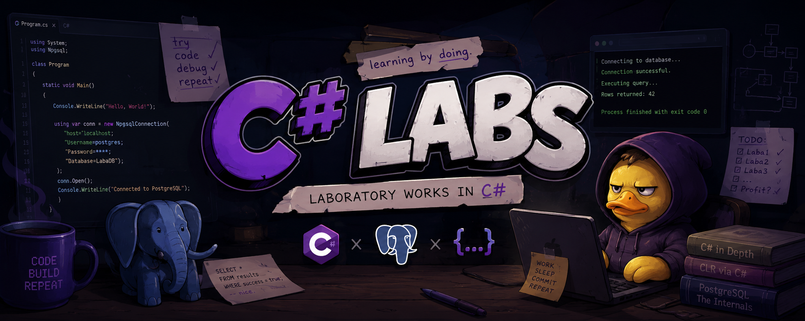

&#x20; 

\# C# Labs

Репозиторий с моими лабораторными работами по \*\*C#\*\*.  

Да, язык мне не нравится, но лабораторки были сделаны, а значит — пусть здесь лежат.

\## Что внутри

\- лабораторные работы на \*\*C#\*\*

\- базовые учебные примеры

\- местами немного \*\*PostgreSQL\*\*

\- решения, написанные в рамках учебной практики

\## Стек

\- \*\*C#\*\*

\- \*\*.NET\*\*

\- \*\*PostgreSQL\*\* \*(частично, где требовалось по заданиям)\*

\## Назначение

Этот репозиторий нужен как архив выполненных лабораторных работ.  

Проект не претендует на полноту, красоту или особую любовь автора к C# — только на честно сделанные задания.

\## Примечание

Если вам зачем-то понадобились лабораторки по C#, то вот они.  

Если мне самому когда-нибудь снова придётся сюда вернуться — значит, судьба решила пошутить.

